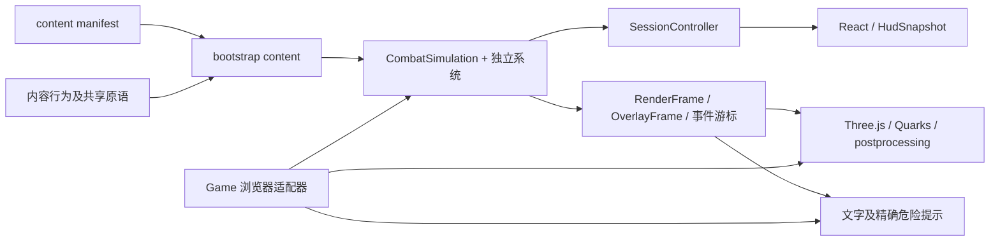

# 架构实施记录

日期：2026-09-20。A–F 迁移阶段已完成。本文描述最终代码和扩展方式；[原始设计](ARCHITECTURE.md)中的示意接口以本文和 `src/contracts/` 为准。

后续素材与火焰扩展已落地：现有 4 本法书、58 件遗物、27 个外观；新增 AssetManager、BookArtwork 和独立 FlameSystem，模拟层继续不依赖浏览器素材加载。具体接入方式见[外部素材与灰烬之书](ASSETS-AND-FLAME.md)。新增 DefenseSystem 与 BookBehavior.counterHit 扩展钩子，见 [防御设计](DEFENSE-AND-PACING.md)。下表保留 A–F 迁移完成时的范围。

本轮继续增加公共视口边界规则、EffectQuality、EdgeVeil 与词库分桶索引；God Mode 通过会话命令进入模拟。当前说明见 [全屏、特效与词库](FULLSCREEN-AND-VOCABULARY.md)。

## 已完成的阶段

| 阶段 | 最终实现 | 验收证据 |
| --- | --- | --- |
| A 目录与注册 | manifest、冻结注册表、生成 ID / 法书及 Boss 行为入口、构建前内容校验 | 第四本法书、未知引用和词令冲突测试 |
| B 会话边界 | SessionController、只读 HUD、RenderFrame / OverlayFrame、浏览器装配、版本化存储 | 无头模拟、候选验证、快照稳定、旧存储兼容 |
| C 公共结算 | 施法、目标、词条占用、弹道、伤害、状态、移动、召唤、阶段、效果来源、事件与调度 | 三法书 180 帧旧轨迹一致；占用回收、死亡一次性、Boss 限伤及过期效果测试 |
| D 内容行为 | 三法书、17 种敌人、4 种精英、3 个 Boss、49 件遗物均由内容配置与共享能力组合 | 任意 ID 的组合敌人、精英、遗物及独立 Boss 实战测试 |
| E 关卡与奖励 | Campaign 战役图、EncounterDirector、稳定房间 ID、分支出口、EligibilityService、独立补给奖励 | 非三波、四房间、目录乱序分支、下一周目、必需任务阻止提前清房 |
| F 表现及收尾 | 外观/终式/音色注册、多页图集与依赖预热、序号提示、旧全局桥移除 | 离线运行、第二页真实 GPU 像素、资源回收、暂停及上下文恢复 |

## 模块边界与状态所有权



`CombatSimulation` 只负责权威状态、生命周期和更新顺序；各系统使用 `Pick<CombatRuntime, ...>` 声明所需能力。`Runtime.ts` 是接口词汇表，不导入具体模拟类。没有第二份可变世界，也没有逐帧序列化实体或通过 React 更新粒子。

| 路径 | 责任 |
| --- | --- |
| `contracts/` | 内容、命令、奖励、HUD、效果来源、事件、音色、只读显示视图 |
| `content/`、`content-sdk/` | 内容定义、行为接口、注册、引用校验、召唤依赖闭包 |
| `simulation/systems/` | Cast、Damage、Status、Projectile、Movement、Enemy、Summon、Phase、Effect、Presentation 系统 |
| `simulation/targeting/` | 输入目标规则与 WordReservations |
| `simulation/progression/` | Campaign、EncounterDirector、RewardSystem、EligibilityService、difficulty |
| `simulation/RelicRules.ts` | 数值修饰、获取/施法钩子、语义能力聚合 |
| `simulation/TaskScheduler.ts`、`EventJournal.ts` | 房间任务取消与独立序号事件读取 |
| `application/` | 会话命令校验、HUD 订阅、显示视图投影 |
| `bootstrap/` | 内置内容注入、浏览器会话装配、目录 API、离线加载协议声明 |
| `platform/` | 版本化存储、经典词库脚本适配、图片和音频素材管理 |
| `game.ts` | RAF、时间步、窗口事件、画布尺寸与资源生命周期 |
| `rendering/OverlayRenderer.ts` | 文字布局、点击框、状态和精确危险提示，布局缓存属于显示层 |
| `rendering/`、`combat/Sound.ts` | 原生 GPU 渲染、第三方粒子/辉光及参数化声音 |

UI 不导入模拟类或渲染器。显示层接收同步绘制期间借用的只读视图；点击文字只向模拟提交目标 ID，由模拟重新校验存活与可选性。`labels`、`castLabel` 已从 WorldState 删除。

## 内容扩展

### 法书、敌人和精英

法书目录为 `content/books/<id>/definition.ts`，新机制实现同目录 `behavior.ts` 的 `BookBehavior`。定义中的 `behavior` 可复用已有能力；`appearance`、`audio`、`visual` 分别引用造型、音色和终式配置。新定义登记 manifest 后自动进入选择页和图鉴；`validate:content` 生成入口及 ID 联合类型。

敌人定义组合共享攻击、移动、正面护甲、镜盾、光环、死亡分裂等属性。`spawnLimit` 控制同时存在的数量，`countsForClear` 声明是否必须击杀；`dependencies` 和 `deathSpawns` 声明可能产生的单位。需要全新攻击原语时，在 `content/shared/enemy-actions.ts` 注册实现。

精英词缀使用 `health`、`mass`、`speed`、`cooldown`、`unfrozenDamage`、`echoDelay`、`deathBlast` 组合，不再根据 swift/iron/echo/volatile ID 分支。manifest 顺序保持原抽选顺序。

### Boss 与关卡

Boss 在 `content/bosses/<id>/` 声明行为、各难度生命、周目成长、护盾单位、阶段阈值与进场召唤。`PhaseController` 管理阶段限伤、保护时间和一次性进入；攻击逻辑在所属 `behavior.ts`。

章节用 `bossId` 引用 Boss；房间声明 `waves`、刷怪池、低难度池、开场池、配额、刷新间隔、节点间隔和目标。当前目标是 `clear` 和 `boss`，需要新的目标机制时扩展导演能力。

房间可以显式声明分支：

```ts
exits: [
  { route: 'rest', to: 'quiet-room' },
  { route: 'elite', to: 'trial-room' },
]
```

`to` 是稳定房间 ID，不是数组下标；省略 exits 使用目录中的下一房间，`exits: []` 为终点。普通战役图禁止环和不可达房间；周目通过明确的继续命令回到战役入口。刷怪池中的重复 ID 仍表示权重。

路线候选及随机结果由模拟生成，UI 只提交候选 ID。必需敌人和带 `blocksClear` 的任务未结束时不能清房；任务来源已死亡时不会永远阻止通关。

### 遗物

49 件遗物使用三种可组合定义：

- `damageModifiers`：有稳定优先级的伤害倍率。
- `hooks`：获取与施法后的效果、间隔、条件和互斥组。
- `grants`：向命名战斗能力提供叠层，例如 `execution`、`bleedStacks`、`shatterStacks`。

复杂命中、死亡、闪避联动保留在对应公共系统，读取 `stats` 能力而非遗物 ID。新遗物可以组合已有能力；只有新机制才新增共享能力及其结算。这样保留原乘算、触发深度和互斥优先顺序，不为每件遗物重复创建监听器。

`RelicRules` 在会话构造时建立索引，层数始终读取权威状态；重开后不遗留旧层数。`EligibilityService` 同时负责生成与选择验证。满阶后的补给是 `SupplyReward`，没有 Infinity 层数的假遗物。

## 结算、任务与事件

伤害、死亡和阶段结算仍遵守原规则顺序；普通、回响、反射、持续伤害与死亡爆炸使用已有明确的 `direct`、`depth` 和来源参数。同步公共系统互相调用，避免事件监听顺序成为规则。

`EffectRequest` 是额外的窄效果入口，携带会话、房间和可选实体来源；拒绝过期来源、失效目标、无效数值及未知召唤。内部受控系统继续直接调用能力接口，未将每一次普通函数调用包装成消息事务。

`WordReservations` 记录弹道原词条所有者，改目标时先释放旧占用；命中、死亡、超时、清房、销毁均收尾，重复释放无副作用。清房不会为旧目标重新抽词。

`TaskScheduler` 保留房间作用域回调，以 generation 和实体来源存活校验取消旧任务；新任务不在同一 tick 递归执行。它不是可序列化录像任务系统，本次没有引入回放或战斗存档。

`DomainEvent` 记录已提交的伤害、死亡、施法及房间事实。`PresentationCue` 以 `(session, sequence)` 加房间标记供 Quarks 独立消费，不再依赖 fx 对象身份。事件日志有界，持久视觉由 RenderFrame 重建；减少装饰或丢弃过期提示不改变玩法。声音通过独立 FeedbackPort 和注入的音色表执行，延迟音符在销毁时取消。

## 原生显示与离线资源

世界由 Three.js 原生绘制；Canvas 仅用于一次性图集创作及独立清晰文字/危险提示，整帧 Canvas 不上传 GPU。主场景基准 1920×1080，位移和辉光默认 960×540，保留 postprocessing 与 three.quarks。

外观定义按 ID 映射 `AppearanceHandle { page, uv }`，每页默认 2048×1024，并遵守设备纹理限制。超过单页容量自动分页，跨页透明精灵按提交顺序绘制，所有页在战斗前上传和预热。一页内容沿用单批次路径。

`UltimateEffects.ts` 注册 crystal / orbit / lightning 处理器；法书用配置引用。`content/audio.ts` 定义音色，章节声明 ambience，Sound 不按法书或章节编号判断。独特图形可扩展 ActorPainter 的绘图原语；新外观也可以直接复用已有 shape。

资源计划解析房间刷怪、分裂、繁殖、Boss 阶段和护盾依赖。当前离线包一次准备全部内置战斗内容，不在首次召唤时创建新图集或编译材质。首页仍不加载原生战场包；加载失败重试、取消、上下文恢复和销毁均保留。

`core.ts`、`types.ts`、`bootstrap/legacy.ts` 已移除。仅离线脚本适配器保留词库及原生渲染入口的最小全局协议；业务不使用旧 KACore / KeyAbyssGame / Types / Elites / Chapters。调试桥只在调试入口提供。

设置、偏好、自定义词库和战报采用带 schema/version 的存储格式，兼容旧无包装数据；未知旧战报 ID 保留，未知法书偏好回落默认值。

## 验证入口

```powershell
npm run validate:content
npm run check:architecture
npm run typecheck
npm test
npm run build
npm run test:architecture
npm run test:ui
npm run test:visual
# 先启动 npm run dev，再执行：
python -X utf8 tests/loading-browser.py
```

最终结果与 1080P 统一采样见 [TESTING.md](TESTING.md)。依赖检查使用 dependency-cruiser / SWC，覆盖 UI、模拟、内容及显示边界；TypeScript 7 兼容性提示不代表未扫描，检查报告必须有实际模块与依赖数量。

全阶段迁移已收尾。后续新增玩法属于在这些扩展入口上开发内容，不再需要先完成旧单体迁移。
