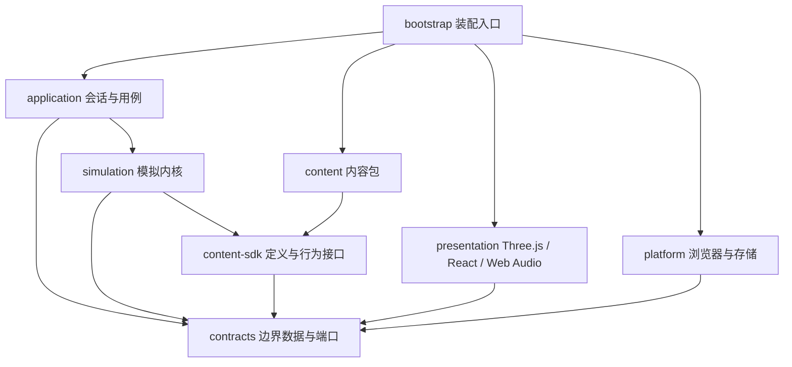
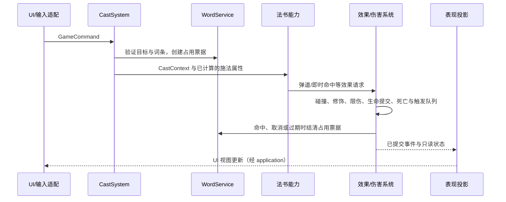

# 可扩展游戏架构设计

> A–F 阶段已完成。最终模块、接口、设计取舍与扩展操作见 [架构实施记录](ARCHITECTURE-IMPLEMENTATION.md)。下文保留实施前的目标设计；示意 API 不替代最终契约。

日期：2026-09-20  
状态：目标设计已实施并完成验收；具体接口以实施记录和 TypeScript 契约为准。  
目标：让新增法书、敌人、关卡、遗物主要发生在各自的内容模块中，并保持战斗判定、画面和 UI 可独立开发、测试。

## 1. 架构决策

采用 **内容定义 + 可组合行为 + 独立模拟内核 + 表现适配器**。

配置描述数值、引用与组合，TypeScript 行为模块实现真正的新机制。通用系统负责移动、目标选择、弹道、伤害、状态、调度和关卡推进；内容模块通过受限接口使用这些能力，不直接修改其他模块的状态。

优先做到：

- 新法书：新增法书定义、施法行为及表现配置，登记后自动出现在选择页和图鉴。
- 新敌人：组合移动、攻击与特性，登记造型，由关卡刷怪池引用。
- 新关卡：声明波次、刷怪池、目标、路线和 Boss，不修改章节取模公式。
- 新遗物：声明获取条件、数值修饰或触发行为，不往多个系统散加 `relics.xxx` 判断。
- 新视觉：为表现标识注册效果，不修改伤害、碰撞或词条逻辑。

现阶段保留 React、Three.js、postprocessing、three.quarks，以及适合当前规模的实体集合和顺序系统。不引入完整 ECS、通用脚本语言、动态 Mod 平台或依赖注入容器。后续若规模或工具需求证明有必要，再单独评估。这里的“可扩展”允许新增底层机制修改对应公共系统，不承诺所有玩法都能靠配置表达。

## 2. 迁移前的结构与扩展阻力

以下保留迁移前的结构分析，用于解释设计动机；当前实现与目录见架构实施记录。

| 当前位置 | 具体耦合 | 扩展时的影响 |
| --- | --- | --- |
| `src/game.ts` | 约 4,100 行；`cast`、`ultimate`、`update` 判断法书；`damage`、`kill`、`enemyAttack`、`updateEnemies` 判断敌人和遗物 | 一项内容跨多个方法修改，容易漏掉互动和清理路径 |
| `src/core.ts` | 词库解析、随机工具、法书和遗物目录、难度公式共处 | 内容目录与通用能力不能独立使用 |
| `src/combat/model.ts` | `Enemy` 同时携带镜盾、冲锋、孵化、Boss 阶段等字段 | 每个实例都需要理解其他敌人的专有状态 |
| `src/types.ts` | `BookId` 手写三项联合；`Game` 直接指向完整类 | 新法书要同步修改类型；界面和渲染能访问全部游戏状态 |
| `beginRoom`、`completeRoom`、`difficulty` | `/ 3`、`% 3`、`% 9` 和固定 Boss 下标 | 增加章节、改变章节房间数会影响多处规则 |
| `src/ui/App.tsx`、`Battle.tsx` | UI 调用游戏 RNG 选路线；路线效果数据在 UI；HUD 固定三个房间标记 | UI 改动可能改变玩法随机序列，新增房间结构需改组件 |
| `Home.tsx`、`Sound.ts`、`SpellBrush.ts` | 法书文案、音色和终式分支分别维护 | 新法书容易出现“能施法但没有完整展示”的情况 |
| `ActorAtlas.ts`、`ActorPainter.ts` | 固定三 Boss、三法书与 32 格图集，绘制器读取 `Game` 和全局目录 | 新造型既要改分支，也可能碰到容量上限 |
| `Game`、`loading.ts`、`window.KA*` | 模拟持有 Canvas、声音、浏览器循环和渲染器；全局对象连接模块 | 无头测试需要模拟浏览器并改写源码导入 |

保留已有成果：严格 TypeScript、74 项机制测试、原生 GPU 战场、独立清晰文字层、第三方特效库、离线延迟加载、1080P 预算和加载生命周期。这些是迁移约束，不重新实现。

## 3. 层次与依赖方向



箭头表示代码依赖。内容由装配入口通过注册表注入模拟，模拟不导入具体法书或敌人文件。内容的视觉子模块只在战场加载阶段进入表现层；目录元数据不能间接导入 Three.js。

| 层 | 拥有的责任 | 禁止的依赖或行为 |
| --- | --- | --- |
| `contracts` | ID、命令、事件、只读视图、平台端口 | 不导入 React、Three.js、浏览器或具体内容 |
| `content-sdk` | 定义类型、行为工厂、参数与引用校验接口 | 不导入 `Game`，不持有完整可变世界 |
| `content` | 内容元数据、配方、行为和表现配置 | 规则文件不能访问 DOM、GPU、存储或真实计时器 |
| `simulation` | 权威状态、系统执行、规则结算、内容行为运行 | 不播放声音、不绘制、不调用 UI、不直接联网 |
| `application` | 开始/结束会话、命令入口、加载协调、视图发布、存储用例 | 不决定伤害公式、刷怪概率或路线随机结果 |
| `presentation` | Three.js、Canvas 文字、React、声音、视觉时间 | 不写入模拟状态、不消耗玩法 RNG |
| `platform` | RAF、输入采集、可见性、文件、存储、经典脚本加载 | 不包含法书、敌人或遗物规则 |
| `bootstrap` | 组装各层、提供实现、建立和销毁连接 | 不成为第二个玩法大类 |

`contracts` 只容纳实际跨边界的数据；内部系统类型留在其所有者旁边。避免把现在的大 `Game` 类型换成另一个大 `Context`。

## 4. 内容组织与注册

### 4.1 内容包结构

```text
src/
  bootstrap/                 装配、浏览器启动、开发调试桥
  contracts/                 IDs / commands / events / views / ports
  content-sdk/               definitions / behavior-contexts / validation
  content/
    catalog.ts               轻量目录，只含首页和图鉴需要的元数据
    manifest.ts              内置内容包的显式登记
    books/frost/             metadata.ts / definition.ts / behavior.ts / presentation.ts
    enemies/quill/           metadata.ts / definition.ts / presentation.ts
    bosses/ink-colossus/     definition.ts / phases.ts / presentation.ts
    relics/shatter/          metadata.ts / definition.ts / behavior.ts
    chapters/lost-library/  definition.ts / encounters.ts
    routes/                 路线定义与奖励
    modes/                  难度配置
    shared/                 可复用攻击、移动、召唤等行为配方
  simulation/
    session.ts              模拟入口与生命周期
    world.ts                权威实体与运行状态
    systems/                输入施法、AI、移动、弹道、碰撞、伤害、状态、召唤
    rules/                  修饰器、触发器、效果执行
    progression/            战役、房间、波次、奖励
    scheduling/             游戏时间任务与取消作用域
    targeting/              目标查询、词条分配与占用
  application/              SessionController / ViewStore / LoadCoordinator
  presentation/
    three/                  现有 rendering 模块迁入并适配
    overlay/                词条、目标锁定、危险提示
    ui/                     现有 React 页面和通用组件
    audio/                  音频提示注册与 Web Audio 适配
  platform/                 browser / storage / offline-loader
  vocabulary/               解析、校验、词池、词库资源描述
  shared/                   小型纯函数：数学、几何、随机实现
```

这是边界图，不要求每个目录立即创建。简单内容可只有一个定义文件；只有专属行为或美术确实存在时才拆文件。

### 4.2 定义、实例、展示分离

- **Definition**：加载后不变的 ID、基础数值、行为配置和引用；全局共享。
- **Runtime**：本局或该实体的血量、冷却、阶段、层数、私有行为状态；归模拟所有，不能写回 Definition。
- **Presentation**：名称、图标、说明、造型、特效和音效引用。规则只通过语义 ID 与其关联，不检查中文 `tag`、颜色或 UI 下标。

例如遗物偏向使用 `affinity: ['storm']` 或明确能力标签，不再依赖 `r.tag === book.short`。跨流派效果优先查询 `projectile`、`chain`、`cold` 等能力；真正专属的觉醒仍可显式引用法书 ID，不为了消除所有 ID 而制造空泛接口。

### 4.3 ID 与注册表

保留现有 `frost`、`storm`、`spirit` 和遗物 ID，避免破坏偏好与历史战报。新增 ID 使用稳定英文标识，与显示名称、排序和键盘词令独立。

内置内容使用显式 manifest：新增模块后只登记一次。生成器从登记结果输出轻量目录、ID 类型和校验清单；不在运行时扫描文件，不通过导入副作用注册。

注册表提供 `get(id)`、`list()` 和构建期校验，加载完成后只读。实体引用使用 `EntityId`，另带会话/房间作用域，避免新房间复用数字 ID 后命中旧对象。

建议按内容类别生成 ID 联合类型，并让规则引用使用类别正确的 ID。生成的 ID 文件不能反向导入完整内容包；定义工厂不依赖生成结果才能运行，从而避免“先编译内容才能生成内容 ID”的循环。动态导入词库不属于玩法插件，其数据仍走运行时校验。

## 5. 扩展协议

以下 TypeScript 片段描述预期接口形状，并非已经存在或可直接复制编译的 API。实现阶段需落实其中引用的类型和约束。

### 5.1 法书：组合能力，专属状态局部保存

```ts
const frost = defineBook({
  id: 'frost',
  metadata: frostMetadata,
  cadence: { every: 4, countTargets: ['enemy'] },
  abilities: { cast: frostCast, empoweredCast: iceSpear, ultimate: iceAge },
  traits: [coldOnHit, shatterFrozen],
  presentation: 'book.frost',
});
```

`CastSystem` 统一处理输入完成、目标有效性、节点与敌人的区别、连奏、共鸣、词条占用；法书行为接收已验证的 `CastContext`，提交伤害、弹道、状态等效果请求。

法书不负责重新实现词条刷新、输入取消、升级、粒子或声音。`BookRuntime` 保存节拍计数与终式状态，纸灵的存在时间归召唤能力实例所有，不要求每本法书都带纸灵字段。

能力工厂将“参数 + 强类型私有状态 + 受限查询/效果接口”封装成实例。注册表只调用统一生命周期；状态类型在工厂内保留，不靠 `Record<string, any>` 存放。需要快照或调试的状态由该工厂显式提供 DTO。

### 5.2 敌人：基础实体 + 移动 + 攻击 + 特性

```ts
const quill = defineEnemy({
  id: 'quill',
  stats: { hp: 65, speed: 25, radius: 19, mass: 1, xp: 7 },
  movement: keepDistance({ preferredRange: 260 }),
  attack: aimedFan({ count: 3, warning: 0.7 }),
  traits: [],
  presentation: 'enemy.quill',
});
```

上例距离和预警时间是接口示例，迁移数值以旧实现为准。基础实体仅包含位置、运动、生命、目标词条和通用生命周期。镜盾、冲锋、孵化等状态由对应行为实例保存；冻结、眩晕、标记等共享机制由 `StatusSystem` 管理。

移动行为输出移动意图，攻击行为输出带预警的攻击请求；运动和碰撞系统负责执行。每个行为只获得需要的查询与命令，例如 `EnemyQuery`、`MovementIntentWriter`、`AttackWriter`，不能获得 `world.enemies` 的可变数组。

精英词缀复用特性机制，声明兼容条件和冲突关系。Boss 是带 `PhaseController` 的敌人定义：每阶段声明阈值、攻击序列、召唤和进入/退出行为。跨阶段限伤、防重复触发及无敌窗口由公共控制器统一实现，不把阶段切换夹在造型或普通伤害分支中。

### 5.3 关卡：战役图、遭遇定义与导演

```ts
const library = defineChapter({
  id: 'lost-library',
  entry: 'library-entrance',
  rooms: [entranceEncounter, galleryEncounter, colossusEncounter],
  transitions: libraryTransitions,
  presentation: 'environment.library',
});
```

- `CampaignDefinition` 定义章节和终点，允许不同章节有不同房间数；周目策略明确指定结束或从哪个入口继续。
- `EncounterDefinition` 定义场地、出生点、波次、加权刷怪池、同类数量限制、开场保护、节点规则、奖励和完成条件。
- `EncounterDirector` 执行刷怪节奏和波次；不因 UI 展示顺序决定下一关。
- `DifficultyPolicy` 接收难度、明确的进度数据、周目和路线修饰，产出遭遇参数；不自行推断 `stage % 9`。
- `RouteDefinition` 同时拥有展示引用、适用条件、遭遇修饰和奖励。模拟生成可选路线 ID，UI 只展示和提交选择。

完成条件首期支持“清完所有要求击杀的单位”和“击败指定 Boss”，保持现有玩法。以后增加存活计时、防守目标等条件时，扩展目标处理器，而不是在导演里按关卡 ID 加判断。

**必须明确的刷怪语义：**配额计数针对导演安排的敌人；分裂和召唤是否阻止通关通过 `countsForClear` 配置。导演同时检查未执行的必要刷怪、活着的必要单位、阻止完成的任务和目标状态，不能仅看当前敌人数组为空。既有分裂/孵化单位必须保留原先阻止清场的行为；Boss 死亡后附属单位按当前清理政策处理。

房间转换通过 `RoomOutcome` 进行：关闭旧房间 → 取消作用域任务 → 结算奖励/待选遗物 → 提供路线 → 提交选择 → 创建新房间。奖励选择没有完成时不能提前创建下一个遭遇。

### 5.4 遗物：数值修饰与触发行为

遗物定义包含：稳定 ID、最大层数、稀有度、法书/能力条件、前置遗物、互斥项、词库长度条件、数值修饰、生命周期触发器及展示元数据。

两类扩展分开：

1. **数值型**：修改直接施法伤害、冷却、最大充能、范围等已命名属性，使用 `Modifier`；不监听每一帧。
2. **行为型**：在施法完成、命中、死亡、闪避完成、房间进入等确定阶段触发，返回效果请求。

```ts
const power = defineRelic({
  id: 'power', maxStacks: 3,
  modifiers: [multiplyPerStack('cast.directDamage', 0.25)],
});

const shatter = defineRelic({
  id: 'shatter', maxStacks: 2,
  hooks: [onDeath({ when: wasFrozen, trigger: shatterExplosion })],
});
```

最大生命等永久属性与“获取时恢复生命”分开表达。重新计算派生属性不能再次治疗；血字契约获取时扣血、每页扣血使用独立触发点，并以 `roomVisitId` 去重。遗物升级只更新一个已安装实例的层数及派生值，不重复注册监听器。卸载、重开和结束会话都要移除其作用。

候选生成和选择验证共用一个 `EligibilityService`，并检查本次 offer 中确实存在该遗物。UI 不能传入任意定义或改变奖励数值；满阶后的补给是明确的奖励类型，不用无限层数遗物伪装。

## 6. 权威结算与事件边界

### 6.1 区分四种消息

| 消息 | 发起方 → 接收方 | 语义 |
| --- | --- | --- |
| `GameCommand` | 输入/UI → 会话 | 请求：施法输入、闪避、释放终式、选择奖励；可能被状态校验拒绝 |
| `EffectRequest` | 内容行为 → 模拟效果执行器 | 内部动作：发射弹道、造成伤害、施加状态、召唤、恢复；由公共系统校验并执行 |
| `DomainEvent` | 模拟 → 规则触发器/应用投影 | 已发生事实：伤害已结算、敌人已死亡、房间已完成；不能回改已提交结果 |
| `PresentationCue` | 表现投影 → 特效/声音 | 亮核、震动、音效等一次性提示；丢弃或降低质量不影响玩法 |

不用一个全局事件总线串联所有逻辑。伤害修饰是同步、明确排序的计算阶段；提交后的触发效果进入局部队列。系统调用和数据所有者可直接追踪，避免依赖监听器注册时间。

### 6.2 一次施法的完整路径



**词条占用是公共协议。**飞行法术对原目标创建 `WordReservation`，关联会话、目标、施法及投射物 ID。命中、过期、原目标死亡、改换目标和清房都必须结清；只允许在对应票据结束、目标仍有效且没有其他占用时换词。重复结清无副作用。反射、回响、节点施法是否占用词条由明确的施法语义决定，不能由特效种类推断。

### 6.3 数值和触发顺序

采用具名计算阶段：基础量 → 加算 → 加算百分比 → 独立乘算 → 最小/最大限制。单个修饰器声明 `stat`、`operation`、`value`、条件和稳定排序键。

伤害需要更明确的阶段：施法属性 → 命中/来源条件 → 攻击方修饰 → 防御特性 → Boss 阶段限伤 → 提交生命变化 → 命中/死亡事实 → 后续效果。旧代码存在有意义的乘算、护盾和阶段保护顺序；迁移时先按实际顺序建阶段，不用新公式“顺便统一”数值。上面的通用公式只适用于已确认语义一致的属性。

同一阶段的钩子按显式优先级、稳定内容 ID、实例序号执行，不依赖文件导入或注册顺序。钩子索引在装备变化时建立；结算时只遍历相关钩子，不扫描全部遗物目录。

每个效果携带 `rootActionId`、`source`、`parentEffectId`、`depth`、命中类别及触发来源。直接施法、回响、反射、持续伤害、死亡爆炸使用明确类别。连锁行为声明允许来源、最大深度、同链去重键和目标排除规则；保留冰裂等现有深度限制。

一次结算事务内按确定顺序排空合法的后续效果，再检查房间完成和升级。死亡标记、奖励及阶段进入只能提交一次。设置有文档记录的事务效果上限作为最后防线：越限时终止该链并记录根动作和触发链，开发检查视为失败；不能把任意截断当作正常平衡规则，也不能把未结清占用票据遗留在世界中。

### 6.4 时间、随机与任务

- `ClockAdapter` 提供浏览器时间；模拟接收时间步，不读取 `performance.now()` 或运行 RAF。
- 保留当前最大 `1/90s` 子步、命中停顿和停帧沙漏语义。当前循环最后一子步可能更短，不能宣称已经是严格固定步长或具备完整重放保证。
- 显式区分正常战斗时间、世界缩放时间和表现时间。暂停/升级/路线冻结模拟；停帧时 WASD 移动及无敌计时保持当前规则。
- 玩法 RNG 与视觉 RNG 分离，随机路线完全移出 React。迁移期先保留玩法 RNG 调用顺序；如要拆成词库、遭遇、奖励等独立随机流，作为规则版本变更，单独更新种子基线。
- 延迟任务使用带 ID 和参数的可检查任务描述，避免闭包捕获失效敌人。归属 `run`、`room` 或 `entity` 作用域，明确使用的时钟、来源死亡是否取消、截止时间和同时间排序。
- 记录版本、内容清单、种子及命令顺序有助于复现，但完整存档/录像回放不作为本次迁移的附加目标。

## 7. 模拟状态、视图和 UI

模拟是唯一可变玩法状态的所有者，系统对自己负责的集合写入，跨系统通过查询与效果执行器协作。

`SessionController` 对外仅暴露命令入口、只读视图订阅和生命周期，不暴露 `Game` 实例：

```ts
interface SessionController {
  dispatch(command: GameCommand): CommandResult;
  getSnapshot(): HudSnapshot;
  subscribe(listener: () => void): () => void;
  start(config: RunConfig): Promise<void>;
  dispose(): void;
}
```

开始用例先完成资源加载和预热，再创建/启动模拟；异步完成时校验加载 token。暂停和菜单命令在应用入口即时处理，不能等待已经暂停的模拟步才执行。战斗命令带顺序号进入当前有效会话，命令批处理不能重复消费输入。

- `HudSnapshot`：当前法书、生命、充能、输入进度、章节/波次、Boss 阶段等 UI DTO。
- `OfferSnapshot`：本次 offer ID、可选奖励/路线 ID 与说明；选择时校验 offer 仍然有效。
- `RenderFrame`：实体位置与造型 ID、状态展示、弹道、场、精确危险形状和词条布局输入。
- `RunReport`：已结算的统计和稳定内容 ID。

HUD 继续在约 90ms 节奏采样，关键输入和状态变化立即发布；React 可使用内置 `useSyncExternalStore`。未变化时 `getSnapshot()` 必须返回同一对象，不能每次读取都新建对象触发无效更新。

渲染每帧读取专门的投影，不深拷贝整个世界。首期采用同步“模拟步结束 → 更新可复用投影缓冲 → 渲染”的约定，投影缓冲由表现投影器持有，使用者不能保存为长期历史。如果以后并行渲染，再引入双缓冲与所有权交换；不在这轮引入 Worker。

暂停属于会话状态，设置弹窗、退出确认、词库工坊属于 UI 页面栈。关闭设置回到暂停不启动模拟；关卡和奖励由模拟决定，UI 的列表顺序与动画不会消耗玩法随机数。

## 8. 渲染、声音与资源的内容扩展

现有 `InstancedBatch`、`ScreenPass`、`BloomLayer`、`ParticleLayer` 继续复用，不重写成熟库。主要改造是消除这些组件对完整 `Game` 和具体法书 ID 的依赖。

内容通过表现描述指定 `appearanceId`、调色板、粒子预设、法阵参数和 `audioCueId`。普通新内容复用现有预设；确需新造型或效果时在该内容的 `presentation.ts` 注册处理器。渲染协调器不增加 `if (book === 'new-book')`。

| 现有组件 | 目标输入与职责 |
| --- | --- |
| `ActorPainter` / `ActorAtlas` | 输入造型定义和 authoring 参数，按 appearance ID 生成图集；不传 `Game` |
| `NativeBattleRenderer` | 接收 `RenderFrame`、相机布局和视觉设置，协调渲染通道 |
| `EnvironmentLayer` | 接收环境主题、玩家位置、时间与活动强度 |
| `SpellBrush` | 通用弧线、结晶、符阵图元；专属效果通过处理器调用 |
| `ParticleLayer` | 消费带序号的表现提示，管理 Quarks 发射器及回收 |
| Canvas 覆盖层 | 接收准确的危险形状和文字投影，不读取敌人行为字段推断预警 |
| `Sound` | 根据音频提示 ID 播放参数化音色，不判断法书或章节编号 |

表现提示使用 `(sessionId, sequence)` 标识与独立消费游标，替代对模拟 `fx` 对象身份的依赖。声音与粒子各自消费一次，不互相清空队列。暂停保留画面；恢复 GPU 上下文时从持久状态重建角色和场，不重复播放历史命中音效。

**图集扩容：**32 格单页改为带页号的 `AppearanceHandle { page, uv }`。默认继续使用 2048×1024 页，在设备纹理限制内分配；按页/材质组织批次。当前内容只占一页时不增加页面。额外页面在出征或明确的房间资源准备阶段创建并预热，不能首次刷怪时才编译着色器。声明该房间可能产生的分裂、召唤和 Boss 附属单位，把依赖闭包一并准备。

首页只加载展示目录；首次出征加载规则和原生表现模块。初期允许加载全部内置战斗内容以简化离线分发，资源体积增长后再按包拆分。仍使用现有 `file://` 可运行的经典脚本封装；全局注册桥只存在于加载适配器内部，不能成为规则依赖。统一以内容清单驱动构建产物和许可校验，未来拆包时替换“文件数必须等于 14”的固定断言。

保留 1920×1080 主场景、960×540 辅助纹理、清晰文字层与减少动态设置。视觉数量预算只能降低装饰表现，不能减少子弹判定、敌人数量、预警或实际伤害。

## 9. 内容校验与兼容策略

`validate:content` 已作为构建前检查提供；以下为完整目标校验范围，当前覆盖项见实施记录。

- ID 唯一、引用存在且类别正确，法书/敌人/遗物/关卡元数据完整。
- 数值有限且在合理范围；冷却、计数、阶段阈值和叠层满足定义约束。
- 关卡入口和出口可达；正常通关图不可意外形成无出口循环，周目循环须明确声明。
- 波次配额与刷怪池兼容，同类上限不能导致剩余配额永远无法生成。
- 遗物前置关系无循环；专属条件和能力条件可满足；获取候选与最终选择使用相同校验。
- 造型、环境、特效、音频及召唤依赖能够解析；图集页面和发射器预算可预检。
- 键盘词令由目录声明并经过现有前缀冲突校验，不再给新增法书假定只有 1/2/3 快捷键。

存储适配器分别版本化设置、偏好与战报。旧 ID 默认保持不变；确需改名时提供显式别名迁移。未知法书偏好回落到默认法书，旧战报的未知内容保留 ID 和保存的显示信息，不删除记录。当前没有战斗中途存档，不因为架构重构承诺跨规则版本恢复整场战斗。

## 10. 渐进迁移顺序与完成判据

每阶段完成后再推进，不一次性替换全部系统。迁移阶段不同时调整平衡、时间步和随机策略。

| 阶段 | 主要改动 | 完成判据 |
| --- | --- | --- |
| A：目录和注册表 | 分离词库工具与内容；建立 manifest、ID/引用校验；UI 改为目录驱动 | 第四本法书元数据可自动出现在首页/图鉴；未知引用和词令冲突在构建前报错 |
| B：会话边界 | 抽出 RAF、输入、存储、声音；建立 SessionController、视图 DTO；路线选择移回规则侧 | UI/渲染不再接受完整 Game；无头测试可直接导入模拟，无源码替换和 window 桩 |
| C：公共结算 | 提取词条占用、弹道、伤害、状态、调度、效果来源和规则钩子 | 延迟命中、Boss 阶段、连锁深度、死亡一次性、清房取消等现有回归保持通过 |
| D：内容行为迁移 | 先迁移 frost 与一个普通敌人，再迁三法书、普通敌人、Boss 和遗物 | 常规新增内容只修改所属模块、登记入口及引用它的关卡/配方；无新中心 ID 分支 |
| E：关卡数据化 | 战役图、遭遇导演、路线和奖励协议；独立难度策略 | 测试章节可拥有不同房间数、不同波次数；不再通过固定三章九场公式推断结构 |
| F：表现注册与收尾 | 造型/特效/声音注册、多页图集、加载清单；移除旧兼容桥 | 全部内容离线可加载；无跨层 Game 依赖；资源释放、暂停与上下文恢复正常 |

阶段 B 可以暂时由 `GameFacade` 包装旧实现，逐步把行为迁出。适配层只翻译接口，不维护第二份权威状态。阶段 C 的高风险顺序按现有实现提取并用回归固定；如果新结算顺序会改变结果，应单独记录和验证，不能作为“等价重构”悄悄引入。

每个旧分支迁移后立即移除对应入口，避免长期同时保留新旧能力实现。`window.__KEYABYSS__` 若仍供浏览器测试使用，只暴露开发调试门面；生产业务不能通过它访问模拟。

## 11. 测试与最终架构验收

不为每个数据对象添加复述定义的测试，重点保护机制和模块边界。

1. **已有机制基线**：保留现有 74 项测试的规则断言，逐步让 harness 直接创建模拟会话。词库与输入纯函数测试保持独立。
2. **高风险结算**：死亡与奖励一次性、Boss 不跳阶段、遗物叠层不重复订阅、词条占用的全部结束路径、房间任务取消、升级与清场同时发生。
3. **确定性边界**：相同规则版本、种子和时间步/命令序列结果一致；开关声音、特效、HUD 更新不改变结果。迁移前后对比固定种子轨迹，而不只看最终胜负。
4. **扩展性样例**：在测试内容包中加入第四本法书、一种组合敌人、一个具有四房间/非三波的章节、一件数值遗物和一件触发遗物。样例不必加入正式平衡池。
5. **资源与浏览器**：继续覆盖离线延迟加载、失败重试、取消、暂停、DPR、输入、文字稳定、上下文恢复；增加超过单页图集容量的资源样例。
6. **依赖检查**：构建检查层间导入和循环；模拟及内容规则禁止引用 React、Three.js、DOM、Web Audio、localStorage 和 UI。优先用成熟的依赖分析工具；首次只需建立明确边界，避免自制完整静态分析器。
7. **性能**：完整迁移后统一重跑现有 1080P 动态场景。不得为了“解耦”每帧序列化全世界、给每个粒子发事件或让 React 跟随每个模拟子步更新。

验收的关键不是文件变多，而是下面四项实际成立：

- 新内容能用局部变更完成，并且缺失引用在运行前被发现。
- 模拟能在没有浏览器、Canvas 和 Three.js 的情况下执行同样的规则。
- UI 与视觉质量变化不会改变刷怪、奖励、词条和伤害结果。
- 开发者能沿“输入 → 能力 → 效果结算 → 事件 → 表现”定位一次行为，且清楚每份状态由谁创建、更新和销毁。

## 12. 后续开发操作清单

| 扩展目标 | 必做修改 | 何时才改公共系统 |
| --- | --- | --- |
| 法书 | 内容定义、能力组合/专属行为、展示与表现引用、manifest、交互测试 | 现有弹道/状态/召唤等能力无法表达新机制 |
| 敌人 | 基础数值、移动/攻击/特性、造型、manifest、遭遇池引用 | 需要新的运动约束、攻击原语或共享状态 |
| Boss | 敌人定义、阶段序列、附属单位依赖、阶段测试 | 需要新的阶段转移或目标完成机制 |
| 关卡 | 遭遇、波次、目标、路线、环境引用、战役连接、通关测试 | 新增一种通用目标类型或导演能力 |
| 遗物 | 获取条件、数值修饰/触发行为、说明、manifest、关键组合测试 | 需要新的结算阶段或尚不存在的效果能力 |
| 特效/音效 | 表现描述或处理器、资源清单、减少动态策略 | 新增渲染通道或通用图元能力 |

A–F 阶段均已实施。新增内容从上表对应模块开始，运行内容校验和相关行为测试；最终接口与保留的实现取舍见架构实施记录。
